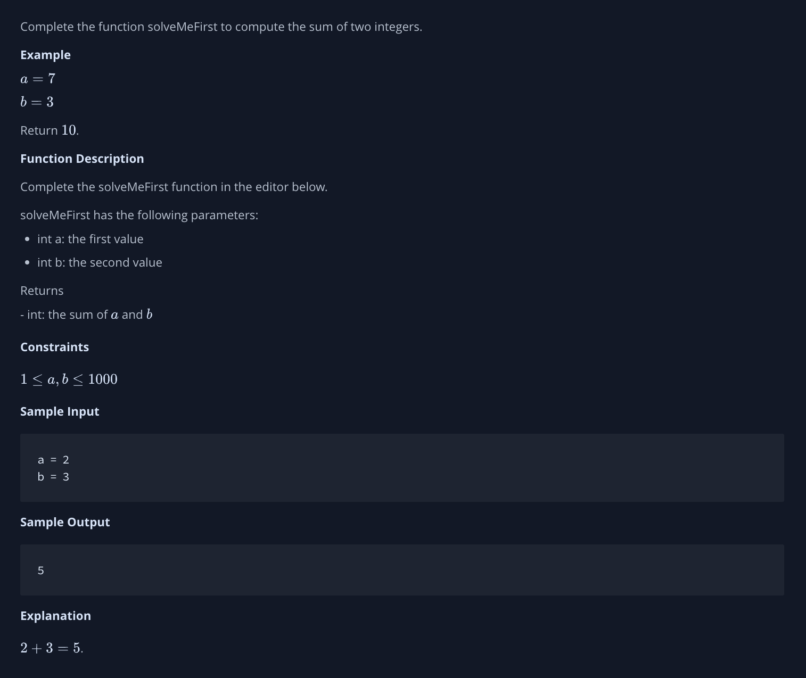
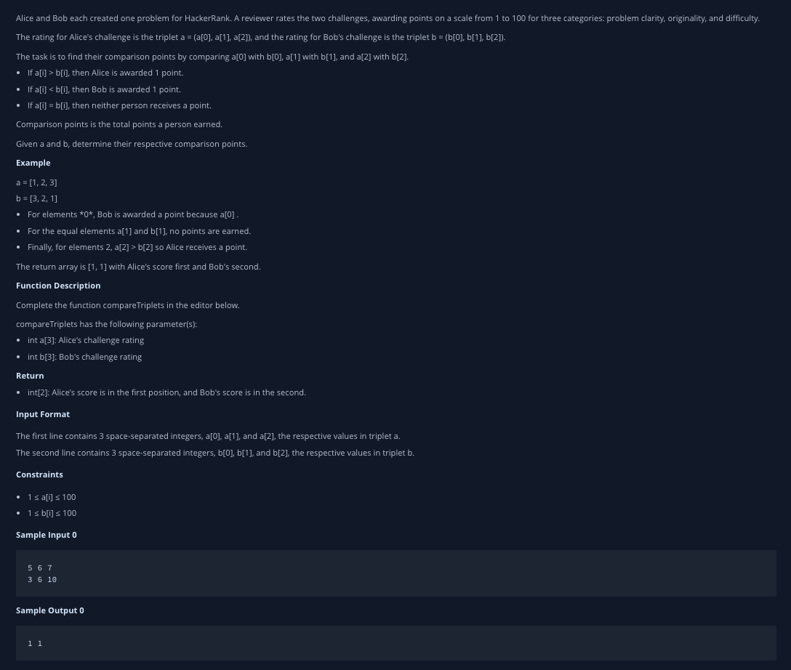

## Algorithm_JavaScript_HackerRank

<br>

## 목표 🙌🏻

- 영문 독해 실력을 늘리며, 다양한 알고리즘 문제를 접한다.
- 클린 코딩을 생활화하고, 깊이 있는 학습을 목표한다.

<br>

## Easy Problems

<br>

### 1. Solve Me First

<br>



```javascript
process.stdin.resume();
process.stdin.setEncoding('ascii');

var input_stdin = '';
var input_stdin_array = '';
var input_currentline = 0;

process.stdin.on('data', function (data) {
	input_stdin += data;
});

process.stdin.on('end', function () {
	input_stdin_array = input_stdin.split('\n');
	main();
});

function readLine() {
	return input_stdin_array[input_currentline++];
}

function solveMeFirst(a, b) {
	// Write your code here
	return a + b;
}

function main() {
	let a = parseInt(readLine());
	let b = parseInt(readLine());

	const res = solveMeFirst(a, b);
	console.log(res);
}
```

### 2. Compare The Triplets

<br>



<br>

```javascript
'use strict';

const fs = require('fs');

process.stdin.resume();
process.stdin.setEncoding('utf-8');

let inputString = '';
let currentLine = 0;

process.stdin.on('data', function (inputStdin) {
	inputString += inputStdin;
});

process.stdin.on('end', function () {
	inputString = inputString.split('\n');

	main();
});

function readLine() {
	return inputString[currentLine++];
}

function compareTriplets(a, b) {
	// Write your code here
	const result = [0, 0];
	let i = 0;
	while (i < a.length) {
		a[i] > b[i] && result[0]++;
		a[i] < b[i] && result[1]++;
		i++;
	}
	return result;
}

function main() {
	const ws = fs.createWriteStream(process.env.OUTPUT_PATH);

	const a = readLine()
		.replace(/\s+$/g, '')
		.split(' ')
		.map(aTemp => parseInt(aTemp, 10));

	const b = readLine()
		.replace(/\s+$/g, '')
		.split(' ')
		.map(bTemp => parseInt(bTemp, 10));

	const result = compareTriplets(a, b);

	ws.write(result.join(' ') + '\n');

	ws.end();
}
```

<br>
